# NTT in Signal Flow Graphs

In the previous chapter, we saw that Signal Flow Graphs (SFGs) can provide a visual representation of algorithms.

In this chapter, we will construct an SFG for the NTT based on the procedure introduced in the article [“NTT algorithm by hand.”](https://rareskills.io/post/ntt-by-hand) 

## The fast NTT algorithm

The aim is to evaluate a degree-($k-1$) polynomial at the $k$-th roots of unity. 

We can do this by multiplying the Vandermonde matrix by the vector of polynomial coefficients, as we saw in the article on the [Vandermonde matrix](https://rareskills.io/post/vandermonde-matrix). However, this naive approach requires $\mathcal{O}(k^2)$  operations.

Fortunately, there are methods that achieve the same goal in $\mathcal{O}(k \log k)$ time. One such method was introduced in the article [NTT Algorithm by Hand](https://rareskills.io/post/ntt-by-hand), which we will refer to as the **Fast Number Theoretic Transform** (fast NTT). The literature often uses the term **NTT** to refer to this fast algorithm, so we will use **NTT** and **fast NTT** interchangeably throughout this series.

The fast NTT algorithm runs in $\log_2 k$ stages, where each stage performs on the order of $k$ operations. For example:

- A polynomial of degree $3$ evaluated at the $4$th roots of unity requires $2$ $(\log_24)$  stages and $\mathcal{O}(4)$ operations in each stage.
- A polynomial of degree $7$ evaluated at the $8$th roots of unity requires $3$ $(\log_28)$ stages and $O(8)$ operations in each stage.

And so on.

An example of this procedure for the $4$th roots of unity is shown in the diagram below. The procedure was introduced in the article *NTT Algorithm by Hand*, but we will review it in this chapter.

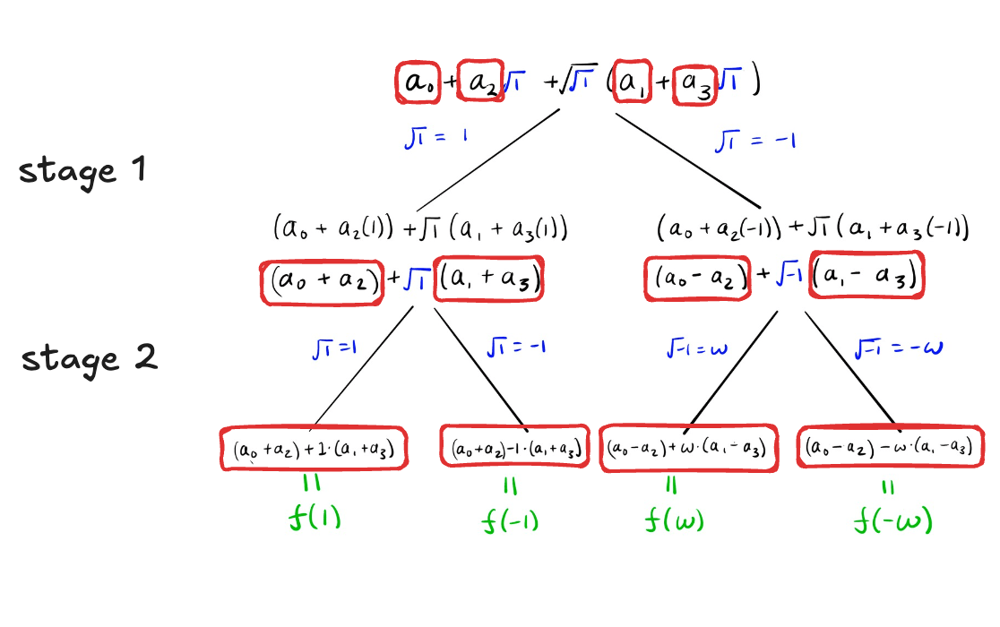

The procedure begins with a vector containing the coefficients of the polynomial:

$$
[a_0, a_1, a_2, a_3].
$$

The first stage transforms this vector into a new four-element vector, whose elements are boxed in red in the image above:

$$
[a_0 + a_2, a_1 + a_3, a_0 - a_2, a_1 - a_3].
$$

The second stage transforms this vector into a new vector of four elements, also boxed in red above:

$$
\begin{aligned}
[&(a_0 + a_2) + (a_1 + a_3), \\ &(a_0 + a_2) - (a_1 + a_3), \\ &(a_0 - a_2) + ω (a_1 - a_3), \\ &(a_0 - a_2) - ω (a_1 - a_3)].
\end{aligned}
$$

These correspond to the evaluations of the polynomial at the points $1,-1,\omega$ and $-\omega$  , respectively.

The goal of this chapter is to translate this procedure into a signal flow graph.

## Translating our hands-on procedure into an algorithm

In general terms, when performing the calculation illustrated above, we executed the following algorithm:

The input consists of the coefficients of the polynomial that we want to evaluate at the $k$-th roots of unity. The calculation occurs in stages.

At each stage, the innermost square root is evaluated and assumes two values, one positive and one negative, until we reach a stage with no remaining square roots. 

At each stage the following occurs:

- Each part of the diagram is divided into two (it branches into two), with the number of coefficients in each new region being halved.
- The coefficients from one stage are added in pairs to generate the coefficients of the next stage.

Let’s compare this idea with what we saw in the diagram above, which is repeated below:

In this diagram, the following occurred:

1. We start with *one* expression with *four* coefficients: $a_0, a_1, a_2$ and $a_3$.
2. The first stage generates *two* branches with *two* coefficients each: $a_0 + a_2$ and $a_1+a_3$ in the left region, and $a_0-a_2$ and $a_1-a_3$ in the right region. Note that the number of regions has doubled, while the number of coefficients in each region has been halved. This happens at every stage.
3. The second stage generates *four* branches with *one* coefficient each. For example, the leftmost branch ends with the coefficient $(a_0+a_2)+(a_1+a_3)$. These final coefficients are the evaluations of the polynomial at the roots $1,-1,\omega$, and $-\omega$.

At each stage, the nesting of square roots is reduced until no square roots remain. The branching process ends, and consequently, the algorithm terminates.

### The case of the 8-point NTT

In the case of an 8-point NTT, we have the following:

1. We start with *one* region and *eight* coefficients.
2. Stage 1 produces *two* branches with *four* coefficients each.
3. Stage 2 produces *four* branches with *two* coefficients each.
4. Stage 3 produces *eight* branches with *one* coefficient each (the final evaluation of the polynomial). No square roots remain, so the procedure ends.

If we multiply the number of regions by the number of coefficients in each region, we always obtain **eight** elements. Therefore, every stage produces an 8-element vector.

The question is how to combine the elements of the vector from one stage to construct the vector of the next stage. That's what we'll see next.

Let us begin by studying the 4-point NTT in detail.

## Tracing evaluations in the $4$th roots of unity

Let's consider a polynomial of degree 3:

$$
\begin{aligned}
f(x) &= a_0 + a_1x + a_2x^2 + a_3x^3 \\
&= a_0 + a_2x^2 + x (a_1 + a_3 x^2),
\end{aligned}
$$

where, in the second line, we have rearranged the terms for convenience.

The idea is to evaluate this polynomial at $\sqrt{\sqrt{1}}$:

$$
\begin{aligned}
f(\sqrt{\sqrt{1}}) &= a_0 + a_2 (\sqrt{\sqrt{1}})^2 + \sqrt{\sqrt{1}}(a_1 + a_3(\sqrt{\sqrt{1}})^2) \\
&= a_0 + a_2 \sqrt{1} + \sqrt{\sqrt{1}} (a_1 + a_3 \sqrt{1}),
\end{aligned}
$$

where, in the second line, we used that $(\sqrt{\sqrt{1}})^2 = \sqrt{1}$.

When computing $f(\sqrt{\sqrt{1}}),$ every square root has two values, causing the computation to branch. The idea is to repeatedly evaluate the innermost square root until no square roots remain. By following this process, we eventually obtain the evaluations of the polynomial at all four fourth roots of unity.

In the diagram below, we follow one particular branch (the leftmost), which leads to the evaluation of $f(1)$:

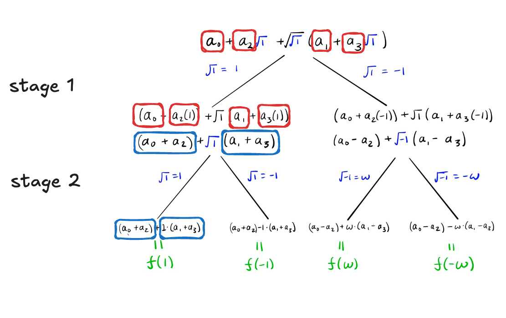

We want to understand in detail how the transition from one stage to the next takes place.

In each stage, the innermost square root is evaluated, causing the computation to branch. For example, in the first stage, the innermost square root is $\sqrt{1}$, whose values are $1$ and $-1$. Thus, the left branch corresponds to the value $1$, while the right branch corresponds to the value $-1$.

These values—the evaluation of the innermost square root at each stage—are what the literature calls the **twiddle factors**. Therefore, twiddle factors (1) are always roots of unity and (2) always come in pairs.

For the first stage, the twiddle factors are $1$ (left) and $-1$ (right).

Once we evaluate one "layer" of square roots, some terms that were previously separated by that square root are no longer separated by a square root. As a result, they can be added or subtracted together (depending on which branch we are on) for the next stage.

For example, initially, $a_0$ and $a_2$ cannot be combined because they are separated by a square root multiplying $a_2$:

$$
\begin{aligned}
f(\sqrt{\sqrt{1}}) 
&= \boxed{a_0 + a_2 \sqrt{1}} + \sqrt{\sqrt{1}} (a_1 + a_3 \sqrt{1}),
\end{aligned}
$$

 
The same applies to $a_1$ and $a_3$: 

$$
\begin{aligned}
f(\sqrt{\sqrt{1}}) 
&= a_0 + a_2 \sqrt{1} + \sqrt{\sqrt{1}} \boxed{(a_1 + a_3 \sqrt{1})},
\end{aligned}
$$

We cannot combine values involving square roots because square roots can yield more than one value. To combine them, we must first branch.

But once we evaluate that square root, these terms can be combined in the next stage.

Thus, after evaluating the square roots in stage 1, we can combine $a_0$ with $a_2$ and $a_1$ with $a_3$. Since the second term in each pair was multiplied by a square root, it is now multiplied by the value of the square root for that branch. 

Therefore, at the end of the first stage, the left branch yields

$$
(a_0 + \boxed{1} \cdot a_2) + \sqrt{\boxed{1}} (a_1 + \boxed{1} \cdot a_3),
$$

with a twiddle factor of $1$. The right branch yields

$$
(a_0 + \boxed{(- 1)} \cdot a_2) + \sqrt{\boxed{-1}} (a_1 + \boxed{(-1 )}\cdot a_3),
$$

where for this branch the twiddle factor is $-1$, corresponding to the $-1$ branch of $\sqrt{1}$.

To analyze the second stage, we reproduce again the previous diagram below.

In the left branch of the first stage, we have two new coefficients (boxed in blue),

$$
(a_0+a_2) \quad \text{and} \quad (a_1+a_3).
$$

They cannot be combined yet because they are still separated by a square root. We repeat the same procedure, evaluating that square root so that the two coefficients can be combined.

This creates another branching, resulting in a total of four branches after the two stages.

Along the left branch of the left branch, we obtain the single coefficient

$$
(a_0+a_2) + \boxed{1}(a_1+a_3),
$$

which is simply the evaluation of $f(1)$, since no square roots remain. The evaluations of $f(-1)$, $f(\omega)$ and $f(-\omega)$ are obtained by following the other branches.

To summarize the procedure: at each stage, we evaluate the innermost square root, causing the algorithm to branch into its two roots. Since the square root has now been evaluated, the two coefficients that were previously separated by it can be grouped together.

## Signal flow graph for the evaluation at the fourth roots of unity

The procedure described above can be represented by a signal flow graph, where the input nodes correspond to the coefficients of the polynomial, the output nodes correspond to the evaluations of the polynomial at the roots of unity, and the intermediate nodes represent the outputs of each stage.

The edges represent additions and are used to combine pairs of coefficients that, after evaluating the corresponding square root, can now be combined. Recall that the combination factor is the twiddle factor, which multiplies the second element of each pair of coefficients. In signal flow graph (SFG) terminology, these twiddle factors are the **weights** associated with the edges.

Consider the evaluation of $f(1)$ in the illustration below:

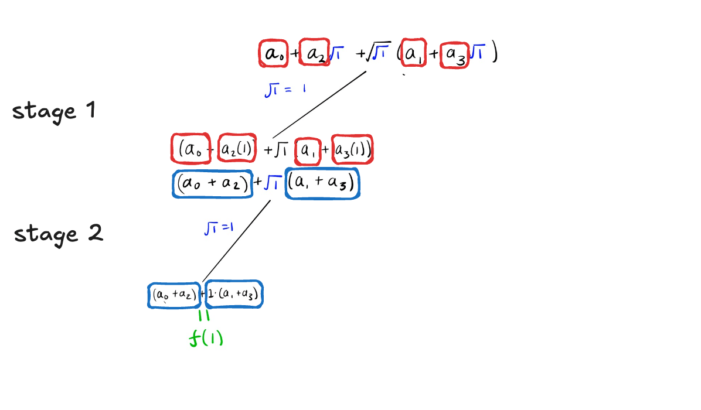

In the SFG, the input nodes are the coefficients $a_0, a_1, a_2$ and $a_3$, and the output node for $f(1)$ is $(a_0+a_1+a_2+a_3)$. The remaining output nodes correspond to the other evaluations at the roots of unity.

The intermediate nodes are $(a_0+a_2)$ and $(a_1+a_3)$, boxed in blue in the figure above.

The SFG corresponding to this particular output is illustrated below:

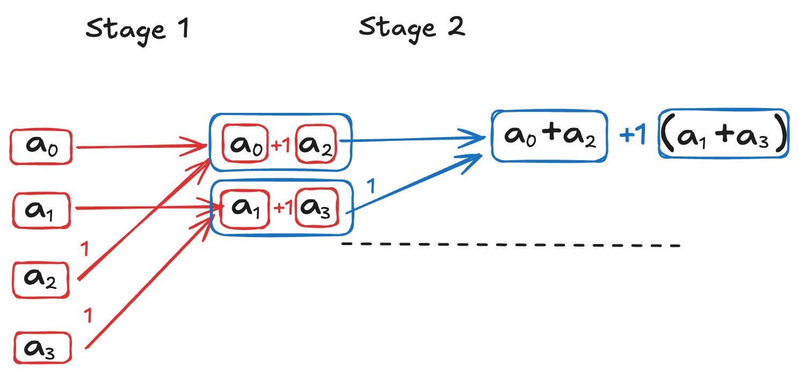

One of the biggest differences between the two graphs is that, in the first, the computation proceeds from top to bottom, whereas in the SFG it proceeds from left to right. Aside from this change in orientation, the procedure is exactly the same.

Let us now consider the evaluation of $f(-\omega)$, as shown below:

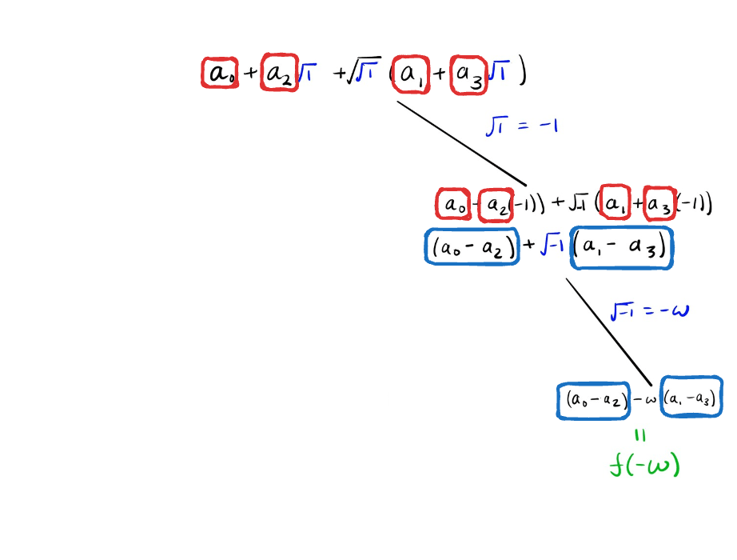

In the signal flow graph, the corresponding diagram is shown below:

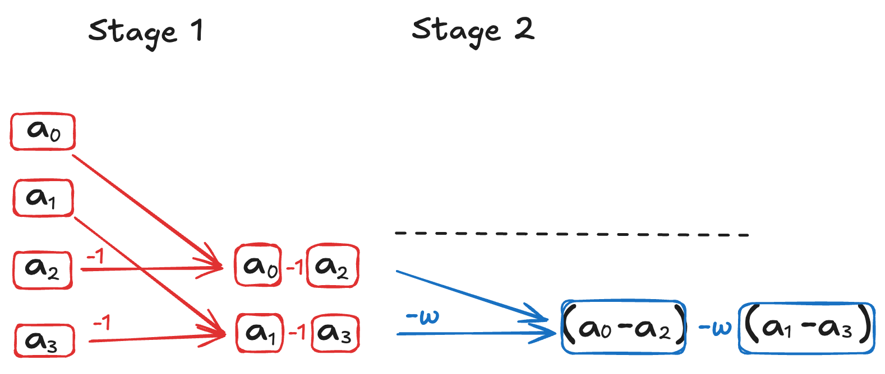

The twiddle factor (the weight in the SFG) is $-1$ for the first stage and $-\omega$ for the second stage.

Signal flow graphs are a tool for visualizing the procedure used to compute roots of unity with the fast NTT. Since we have already learned how to compute the roots *by hand*, constructing the signal flow graph follows exactly the same procedure as in the *NTT Algorithm by Hand* article, with the only difference being that it is expressed using SFG notation.

In both procedures of the $k$th-root NTT, the computation proceeds in $\log_2k$ stages, with $k$ input coefficients, $k$ output coefficients, and a vector of $k$ coefficients at each intermediate stage.

What we need to learn (or review) is:

- how the coefficients should be paired between stages, and
- how to compute the twiddle factor of each branch at each stage.

We will begin with the first point.

## How nodes connect at each stage

Consider the illustration below of a 4-point NTT, where we show only the coefficients at each stage. Note that initially we have one region with four coefficients. After the branch in stage 1, we have two regions with two coefficients each. After another branch in stage 2, we end up with four regions with one coefficient each.

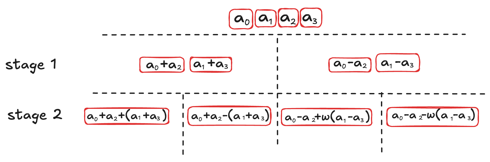

The same diagram can also be illustrated by arranging the coefficients vertically, as shown below.

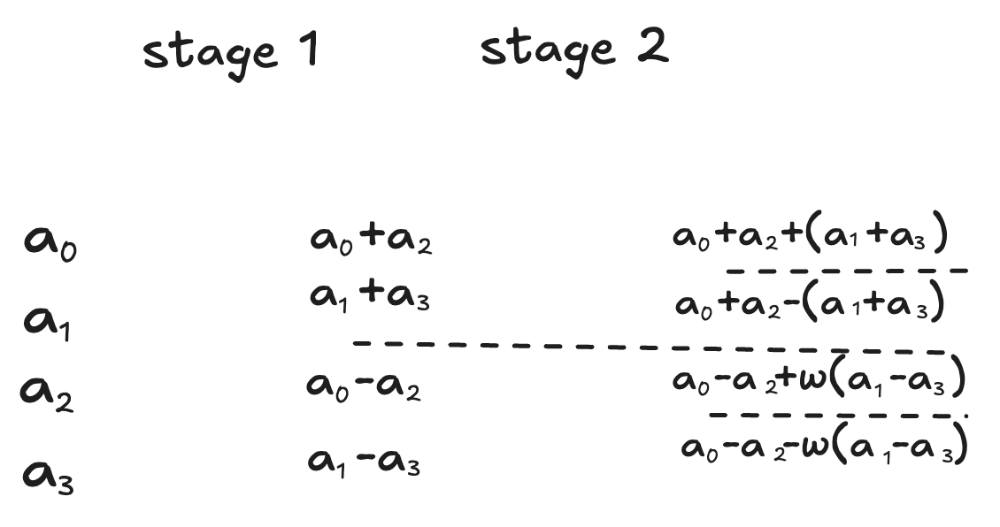

In an SFG, stages represent transformations from inputs to outputs. The input to stage 1 consists of the polynomial coefficients, and the output of stage 1 becomes the input to stage 2. 

In the case of the $4$-point NTT, the output of stage 2 consists of the evaluations at the $4$-th roots of unity.

In this section, we focus on the rule for connecting the nodes. In the next section, we describe the rule for defining the weight of each branch.

### Rule for connecting nodes

At each stage, the nodes are connected as follows: 

- node $a_i$ connects to node $a_{i+\frac{q}{2}}$, where $q$ is the number of inputs in each region at that stage.

*At this point, we will accept this fact on faith. In the final section of this article, we will explain why we chose to connect the coefficient $a_i$ to $a_{i + \frac{q}{2}}$.*

For example, in stage 1 of the 4-point NTT, we have four input nodes ($q=4$); therefore, $\frac{q}{2}=2$, and the connections are 

$$
a_0 \leftrightarrow a_2, \hspace{10pt} a_1 \leftrightarrow a_3 
$$

This connection can be illustrated using what is called a **butterfly unit**, as shown in the graph below. The name "butterfly" comes from the fact that the diagram resembles the wings of a butterfly.

*From now on, in the SFG, we will remove the arrows from the edges, since it is implied that the components on the left generate the components on the right.*

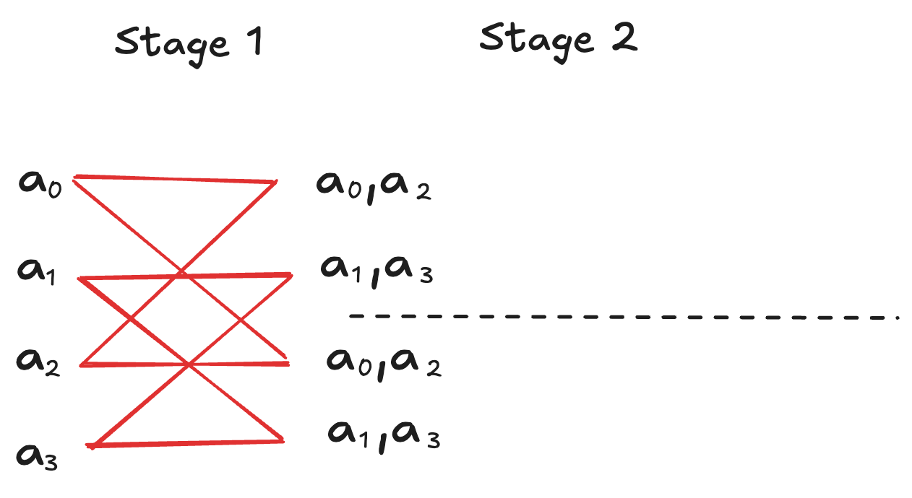

The value $s=\frac{q}{2}$ is called the **stride**; it is the spacing between the two nodes connected in each butterfly. In the first stage above, the stride is 2.

It is important to note that we have two copies of the pairs $(a_0, a_2)$ and $(a_1,a_3)$. This duplication is due to branching into regions, and the final values for stage 1 are affected by the weights, which we discuss in the next section.

The repeated diagram below shows the two butterflies of the first stage. Coefficient $a_0$ is connected to $a_2$, and coefficient $a_1$ is connected to $a_3$.

Please keep in mind that pairs such as $(a_0, a_2)$ represent a single element that will eventually be combined as $a_0 + W \cdot a_2$ once we know how to calculate the weight. For now, we will simply denote such elements as $(a_0, a_2)$ without explicitly indicating how $a_0$ and $a_2$ are combined to form a new coefficient.

To better explain the procedure, let us assign names to the nodes in stage 1. The nodes in the upper region will be labeled $b_0$ and $b_1$, while those in the lower region will be labeled $c_0$ and $c_1$, as shown below:

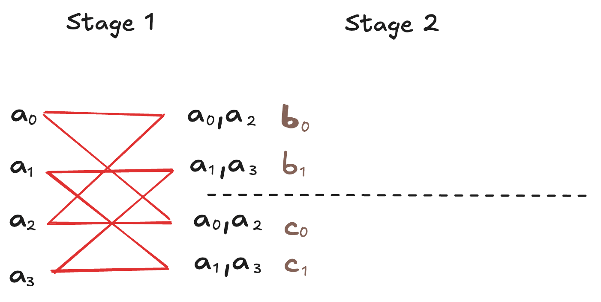

In stage 2, we proceed as before. Each region has two nodes as inputs; therefore, the stride is $s = q/2  = 2/2=1$, and the combinations are

$$
b_0 \leftrightarrow b_1, 
$$

and

$$
c_0 \leftrightarrow c_1.
$$

Branching occurs again, increasing the number of regions to four. Now each region has only one node, and it is no longer possible to split the diagram further. This is the final diagram, and we are left with the task of determining how to assign the weights at each stage.

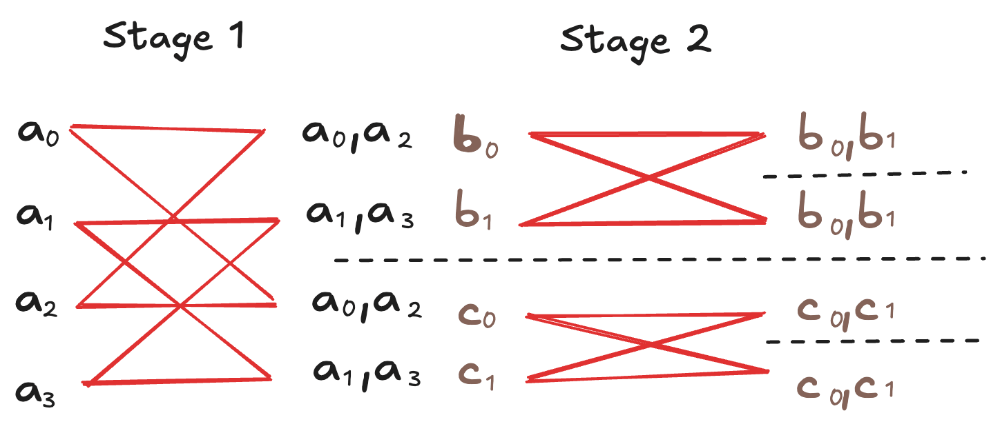

But before discussing the weights, let us look at a diagram for the 8-point NTT.

### The 8-point NTT diagram

For the 8-point NTT diagram, stage 1 has eight nodes with coefficients $a_0$ through $a_7$ as inputs. Therefore, the stride is $s=\frac{8}{2}=4$, and the nodes are connected as follows:

$$
\begin{aligned}
&a_0 \leftrightarrow a_4 \\
&a_1 \leftrightarrow a_5 \\
&a_2 \leftrightarrow a_6 \\
&a_3 \leftrightarrow a_7
\end{aligned}
$$

This is illustrated below.

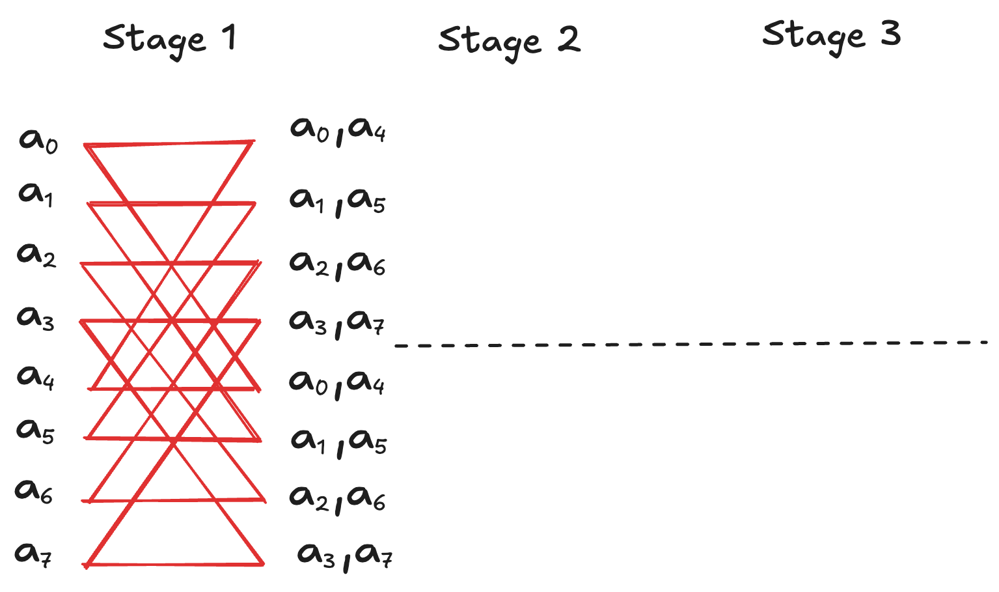

Stage 2 has two regions, each with four nodes as inputs. The stride is half the number of nodes; therefore, the stride is $s=\frac{4}{2}=2$. 

Node 0 connects to node 2, and node 1 connects to node 3 in each region. This is illustrated below.

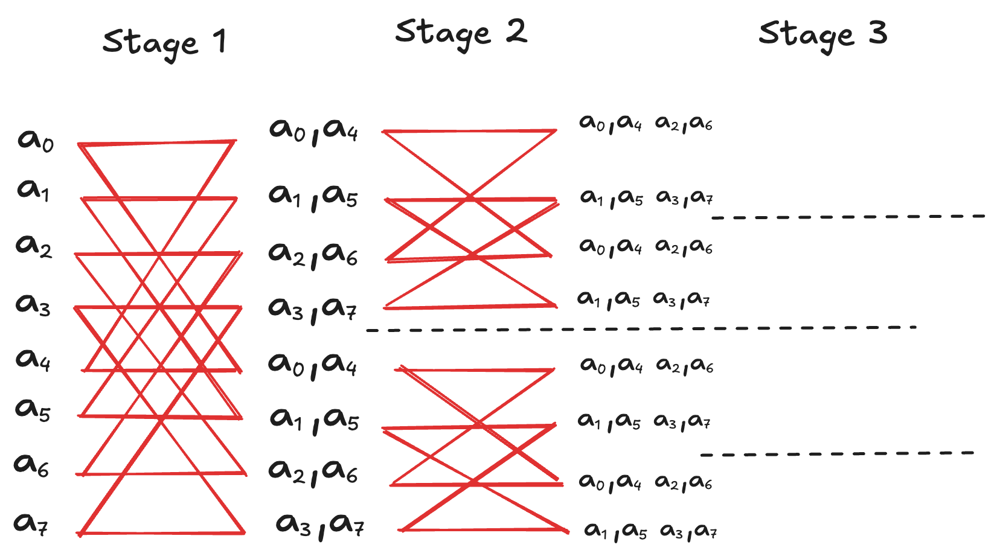

Stage 3 consists of four regions, each with two nodes as inputs.

The stride is $s=\frac{2}{2}=1$, so each node connects to the only other node in the same region. The algorithm then terminates, and we obtain the following SFG:

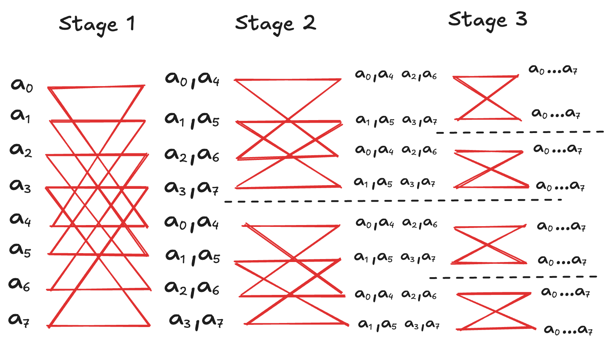

Note that we start with a vector of eight coefficients, and at each stage we obtain a new vector of eight elements in total, over $\log_2 8=3$ stages, as illustrated below.

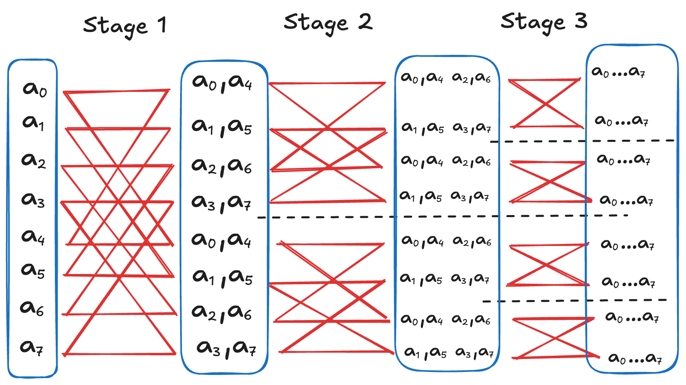

Notice how at each stage:

- the number of regions doubles,
- the number of input coefficients per region is halved, and therefore
- the stride is halved.

What we need to understand now is how to assign the weight to each branch so that we can compute the new coefficients after each stage.

## How the weights are calculated

Every time a branch occurs, the second term of each combination is multiplied by a value $W$, called the twiddle factor, or simply the weight in SFG terminology.

Let us examine this in the case of the 4-point NTT, shown again below.

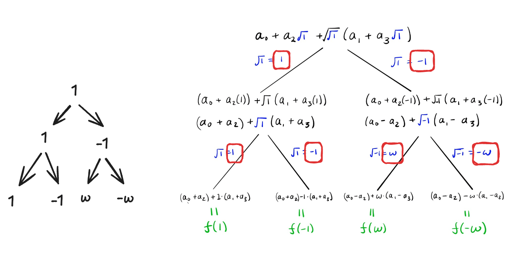

In the first stage, the coefficients $a_o$ and $a_2$ are combined as

$$
a_0 + 1 \cdot a_2
$$

on the left and 

$$
a_0 + (-1) \cdot a_2
$$

on the right, and the same happens for $a_1$ and $a_3$. The reason is that we are taking $\sqrt{1}$, whose values are $1$ and $-1$.

The second stage follows the same pattern: the region that went to $1$ branches into $\sqrt{1}$, whose values are $1$ and $-1$. The region that went to $-1$ branches into $\sqrt{-1}$, whose values are $\omega$ and $-\omega$ in the $4$th roots of unity. 

The butterfly diagram below represents the 4-point NTT with the appropriate weight factors. We have introduced intermediate values $b_0, b_1, c_0$ and $c_1$ to better illustrate the calculations.

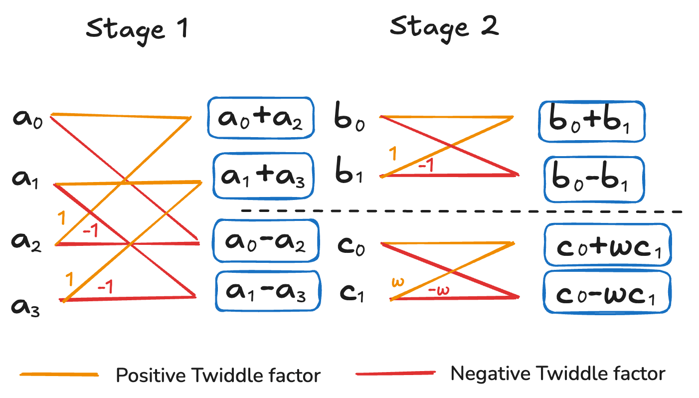

The same can be done for the 8-point NTT, where $\omega$ is now a primitive $8$th root of unity. We only need to keep track of the weight factor $W$ that generated each region; the weight factor for the next regions from this branch are given by $\sqrt{W}$.

For example, in the diagram below, the lower region of stage 1 was generated by the weight factor $-1 \equiv \omega^4$; therefore, its next weight factors are $\sqrt{\omega^4} = \pm \omega^2$ in the $8$th roots of unity.

In the figure, we omit the negative value of the weight factor, which is implicit from the positive one.

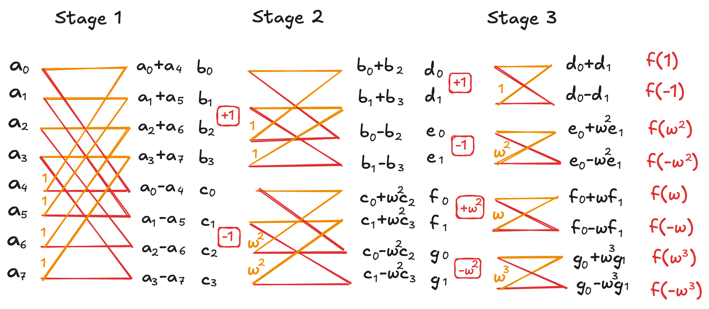

This gives us an algorithm for computing the output of each stage from its input.

Note that to compute the eight new coefficients at each stage, we need only one addition (or subtraction) and one multiplication by the corresponding weight.

Thus, for $k$ a power of 2, this algorithm can be performed with $2k$ operations per stage over $\log_2 k$ stages, for a total time complexity of $\mathcal{O}(k \log k)$.

An algorithm based on the SFG above is usually called a radix-2 DIF NTT, although the radix-2 DIF algorithm commonly found in the literature is not the same as the one presented above.

In the next chapter, we will discuss another way to construct the SFG for our procedure. Before that, let's conclude this chapter by explaining once again why we connect the coefficients $a_i$ and $a_{i+\frac{q}{2}}$ at each stage.

## Why connecting $a_i$ with $a_{i + \frac{q}{2}}$

We have emphasized that the key aspect of the algorithm is the ability to add two coefficients—previously separated by a square root—by evaluating that square root.

Thus, it is essential to connect coefficients whose square root will be fully "consumed" at the current stage.

For example, for the 4-point NTT, consider the polynomial below:

$$
f(x)  = a_0 + a_1x+ a_2x^2 + a_3 x^3
$$

Evaluating this polynomial at $\sqrt{{\sqrt{1}}}$, we obtain

$$
\begin{aligned}
f(\sqrt{\sqrt{1}}) &= a_0 + a_1 \sqrt{\sqrt{1}} + a_2 \left(\sqrt{\sqrt{1}}\right)^2 + a_3 \left( \sqrt{\sqrt{1}} \right)^3 \\
&= a_0 + a_1 \sqrt{\sqrt{1}} + a_2 \sqrt{1} + a_3 \sqrt{1} \sqrt{\sqrt{1}}
\end{aligned}
$$

The factor $\sqrt{1}$ will be fully evaluated at this stage during branching, whereas $\sqrt{\sqrt{1}}$ will not. Thus, the idea is to combine coefficients that can be combined through the evaluation of $\sqrt{1}$.

In the example above, we combine them as follows:

$$
\begin{aligned}
f(\sqrt{\sqrt{1}}) 
&= \left(a_0 + a_2 \sqrt{1}\right) + \sqrt{\sqrt{1}} \left(a_1 + a_3 \sqrt{1} \right)
\end{aligned}
$$

The key point is that, with $q$ coefficients, the square root that can be fully evaluated will always correspond to the term $x^\frac{q}{2}$.

We will not prove this fact, but let's look at another example.

Consider the polynomial

$$
f(x)=a_0 + a_1 x + a_2 x^2 + a_3 x^3 + a_4 x^4 + a_5 x^5 + a_6 x^6 + a_7 x^7
$$

The polynomial will be evaluated at $\sqrt{\sqrt{\sqrt{1}}}$, and we have that $\left(\sqrt{\sqrt{\sqrt{1}}}\right)^4 = \sqrt{1}.$ That is, $x^4$ is the term that yields a "pure" square root. Therefore, we group coefficients whose corresponding terms are four powers of $x$ apart:

$$
f(x)=\boxed{a_0 + a_4 x^4} + x \boxed{(a_1 + a_5 x^4)} + x^2 \boxed{(a_2 + a_6 x^4)} + x^3 \boxed{(x_3 + a_7x^4)}
$$

As a final example, consider the 16-point NTT, where we evaluate a polynomial of degree $15$ at $\sqrt[16]{1}$. The only power that results in a "pure" square root is

$$
\left(\sqrt[16]{1}\right)^8 = \sqrt{1}. 
$$

Therefore, we group coefficients that are eight positions apart.

This idea follows exactly the same pattern from stage to stage. At a stage with $q$ coefficients, we can factor the polynomial so as to combine terms whose exponents differ by $q/2$, such that they are separated by a "pure" square root.