# Signal Flow Graphs

An algorithm or an algebraic expression can be visually represented through a Signal Flow Graph (SFG). In this chapter, we will:

- Illustrate what a signal flow graph looks like.
- Define a signal flow graph and its components in detail.
- Construct a signal flow graph for the Fibonacci series.

## What does a signal flow graph look like?

Consider an algorithm that takes two variables, say $a$ and $b$, as inputs and produces their sum, denoted by $y$, as the output:

$$
y=a+b
$$

Here, $y$ is the variable representing the sum of $a$ and $b$. 

Example:

$$
a=1, b=3\rightarrow y=1+3=4 \\

$$

The operation $y=a+b$ can be represented visually in the following way: 

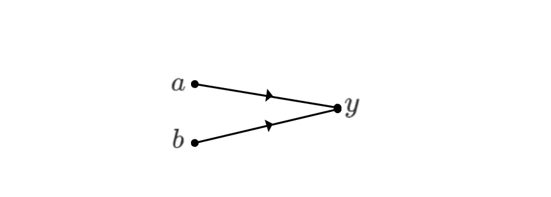

or, if the operation is not clear from the context, we can illustrate it explicitly, as in:

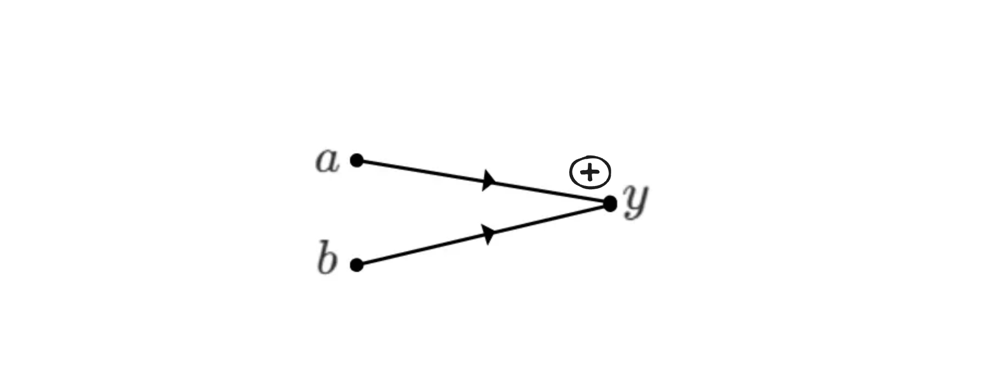

This representation is called a Signal Flow Graph (SFG). A signal flow graph is a visual representation of an algorithm that takes various inputs (here, $a$ and $b$) and produces corresponding outputs (here, $y$). We will now examine the components of an SFG.

## Components of an SFG

A signal flow graph is mainly composed of **nodes** and **edges**, where nodes represent variables and are depicted as dots, and edges are line segments connecting any two nodes. In the following SFG, there are three nodes, $a$, $b$, and $y$. There are also two edges: one connecting node $a$ to node $y$, and another connecting node $b$ to node $y$.

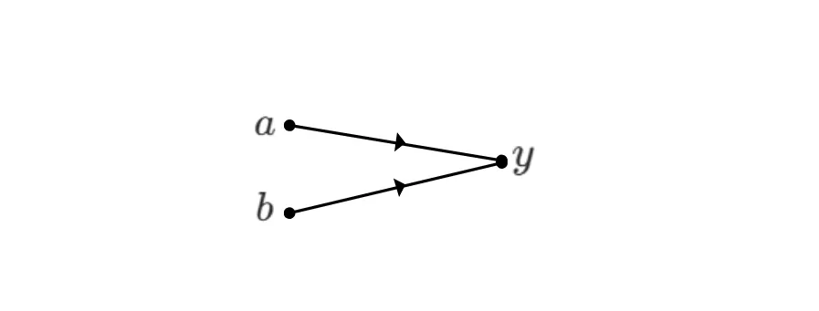

Node $a$ and node $b$ are called **input nodes**, and $y$ is called an **output node**. 

An input node has only outgoing edges. An output node has only incoming edges. A mixed node can have both incoming and outgoing edges. We will look at examples involving mixed nodes shortly.

An edge represents a specific operation. For example, in the graph above, if the edges represent addition, then the output variable $y$ is given by

$$
y=a+b
$$

If the operation is a comparison, then $y$ is given by

$$
y=max(a,b)
$$

or

$$
y=min(a,b),
$$

depending on which comparison operation is used. 

The arrow on an edge indicates its direction, which determines whether it is an incoming or outgoing edge with respect to a node. If no direction is specified, we assume a left-to-right direction; that is, the edge is outgoing from the node on the left and incoming to the node on the right.

**An SFG describes how variables interact with one another through nodes and edges.**

A **mixed node** is a node that has both incoming and outgoing edges, like the nodes $p$ and $q$ in the illustration below.

A mixed node or an output node always represents the result of its incoming edges, depending on the operations associated with those edges. Let us consider the following SFG:

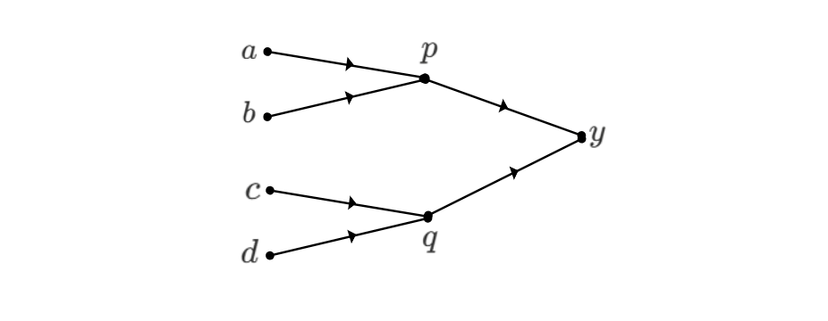

Here, if the operation associated with the edges is addition, then

$$
\begin{aligned}
p&=a+b\\
q&=c+d\\
y&=p+q
\end{aligned}
$$

Node $p$ is the sum of the values arriving from nodes $a$ and $b$. Node $q$ is the sum of the values arriving from nodes $c$ and $d$. Finally, node $y$ is the sum of the values arriving from nodes $p$ and $q$.

## Weighted Edges

An edge can have a weight assigned to it. The weight is a factor that multiplies the value of a node before the operation associated with the edge is applied. Let us look at the following example to understand this.

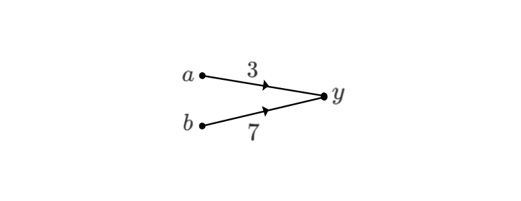

In the above graph, the weight $3$ multiplies $a$, and the weight $7$ multiplies $b$. The operation is assumed to be addition.

The addition operation then produces the output

$$
\begin{aligned}
y&=3\cdot a+7\cdot b\\
&=3a+7b
\end{aligned}
$$

If an edge has no weight assigned to it, then the weight is assumed to be $1$, meaning the node value is multiplied by a factor of $1$. For example, in the SFG below with the operation defined as addition:

The value of $y$ is given by

$$
\begin{aligned}
y&= 1\cdot a+1\cdot b\\
&=a+b
\end{aligned}
$$

Subtraction can be achieved by using negative weights on an edge. For example, in the SFG below:

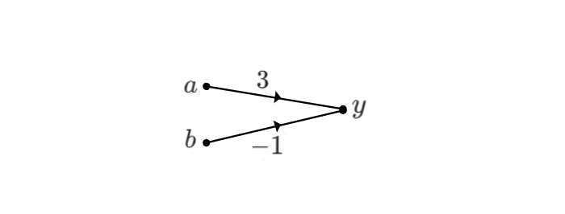

The value of $y$ is

$$
\begin{aligned}
y&=3\cdot a + (-1)\cdot b\\
&=3a-b
\end{aligned}
$$

Signal flow graphs can be used to represent and interpret a wide variety of algorithms and problems. Let us look at one example next.

# The Fibonacci series as an SFG

Consider the famous Fibonacci series:

$$
0,1,1,2,3,5,8,13\cdots
$$

Each element in the series is the sum of the previous two elements, with the first and second elements being $0$ and $1$ respectively.

The Fibonacci sequence can be represented as an SFG in which the edges perform the addition operation. Let us build the Fibonacci SFG for elements up to $13$. Let

$$
a=0, \quad b=1\\

$$

These two variables, $a$ and $b$, are the input nodes of our SFG. The next element, 

$$
c=a+b=0+1=1,
$$

 can be represented as:

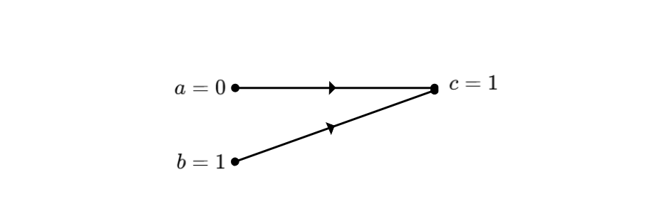

For the next element,

$$
d=b+c=1+1=2,
$$

we add two edges and a node $d$ to obtain:

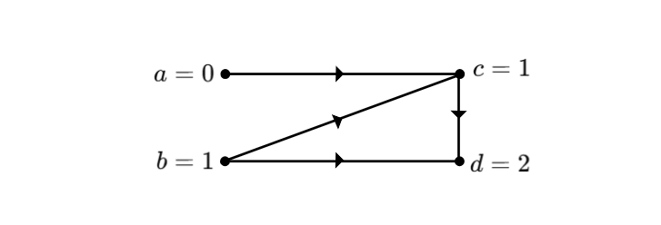

Similarly, node $e=c+d=1+2=3$ is represented as:

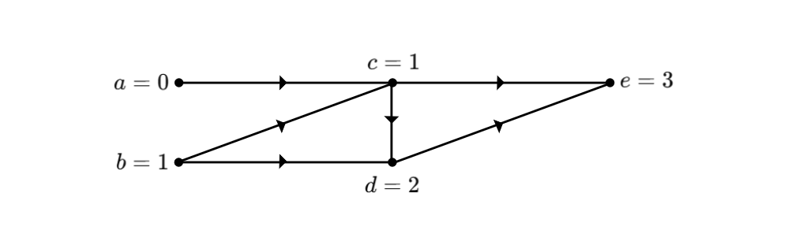

We continue constructing the SFG until we reach the output node

$$
h=f+g=5+8=13
$$

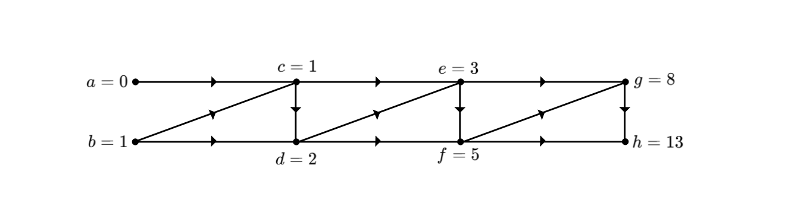

The above SFG can be extended further to reach any $n^{th}$ Fibonacci element. Therefore, the algorithm for calculating the $n^{th}$ Fibonacci element can also be represented as a Signal Flow Graph, where we take the first two elements as input nodes and the $n^{th}$ element appears as the output node. Other nodes are mixed.

For readers already familiar with the Fibonacci SFG, the graph can, for simplicity, be represented without directions, as follows:

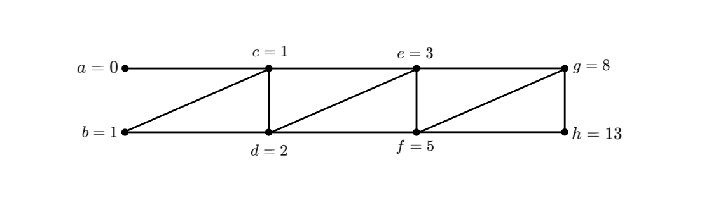

In general, when we know the context of the algorithm that the SFG is representing, it is common to illustrate the edges without using arrows.

In the next chapter, we will see how to use Signal Flow Graphs to write an algorithm to perform the NTT.

*This article is part of a series on the Number Theoretic Transform in our [ZK Book](https://rareskills.io/zk-book)*
